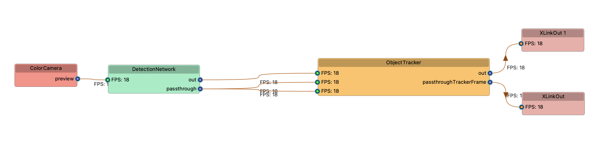

# TrafficMonitoring-usingYOLO
## Setup
For how to set up and use this project, see [SETUP.md](SETUP.md)
## Research Documentation
Research Documentation can be found [here](research_journals/), with studies on each area surveyed.
## Project Overview
### Context
Singapore is a densely populated city, and as a result much effort is put in by the government in order to create road infrastructure that safely and effectively controls traffic. However, peak hours still result in high car density, which can vary depending on the intersection.

Being able to collect data on traffic such as vehicles per hour, speed, and even type of vehicle can provide valuable insight into how to increase road efficiency. For instance, it is shown that vehicle size has a larger correlation with congestion than vehicle speed. Being able to record data showing many trucks can help show the average size of a vehicle.

### Objective
This project aims to collect traffic flow data at busy roads and intersections. This data can be used to determine when traffic density spikes, and which intersections are busiest. 

In order to collect accurate data in various settings, Luxonis' [Oak-1 Lite Depth-AI camera](https://docs.luxonis.com/projects/hardware/en/latest/pages/NG9096/) was used. This is a high-resolution camera which employs on-chip machine learning, allowing it to efficiently run real-time computer vision programs, even on smaller computers such as a Raspberry Pi. Therefore, this solution is very lightweight and can be easily compacted, allowing for an easy yet reliable setup

Collect Traffic Data using Oak-1 Lite Depth-AI Camera and YOLO-v4-tiny MobileNetV2 Neural Network

### Concept
There are 3 points of emphasis in this project: **Accuracy, Efficiency,** and **Compatability**. 

In order to collect meaningful data, the method of collection must be sound. This means that when counting cars moving through traffic, the Depth-AI camera should be able to count the vehicle without missing it or double-counting it, as well as record it with enough information to be used later. Ideally, the neural network employed should be able to distinguish between vehicle types as well.

While accuracy is a significant part of the project, it is rendered useless if the program is not efficient. Luxonis' Depth-AI module uses a pipeline-based model in order to initiate active object detection and machine learning. Without proper setup, numerous problems can occur, such as low framerates and data overload. These can result in programs crashing and miscounting.

Compatability, or variablity, is also very important for this project. The intention is to be able to simply set up the camera and power it on at any street, with any vehicle at any time. Therefore, it is important that this project can acheive results in a variety of conditions, whether that be on the side of a street or on an overhead bridge.

### Structure
In order to acheive these 3 points of emphasis, my project is set up in the following structure:
1. Data collection by Oak-1 Lite camera, data written in .csv format into .txt file. This program runs on RPi autostart
2. .txt files stored in [raw_data](data/raw_data) folder with the following convention: Data Sample #,# of vehicles,time elapsed,time started
3. Post-collection, programs that compile the raw data into legible forms such as spreadsheets and graphs can be ran, which offer user configurability

Further notes on research/project progress can be found [here](research_journals/NOTEBOOK.md)

## Data Collection

**Important Note on Data Collection:** The data collected in this project is ***completely anonymous*** due to the following reasons:
1. The Depth-AI Camera does not record video
2. No license plate data is collected
3. When collecting data, the Raspberry Pi is not connected to any devices via Bluetooth of Wi-Fi

### Data Collection Scripts

[main.py](depthai_collection/main.py) is the main executable script. Its intention is to run on startup with no editing. In order to modify properties such as detection zone, default rush hours, or detection network file, go to [params.py](params.py)

[mainXgpio.py](depthai_collection/mainXgpio.py) is meant for troubleshooting on a laptop or computer. The default [main.py](depthai_collection/main.py) script uses the Raspberry Pi's GPIO module, which is only available on the RPi itself. Additionally, instead of a try-except loop, [mainXgpio.py](depthai_collection/mainXgpio.py) simply allows an error to be thrown

## Pipeline

### Data Samples
Each sample collection is analyzed in seperate notebooks:

1. [Corporation Road](research_journals/corporation.md)
2. [Westgate Mall](research_journals/westgate.md)

## Data Analysis

There are 2 main data analysis scripts: [DataInterpreter.py](data_analysis/DataInterpreter.py) and [graph.ipynb](data_analysis/graph.ipynb). Note that using [graph.ipynb](data_analysis/graph.ipynb) with the RPi does not show graphs, at least without any downloaded extentions

**[DataInterpreter.py](data_analysis/DataInterpreter.py)** allows for users to interact with the raw data, and put it into more valuable and legible forms. There are a number of utility scripts as well, which all have their own commands.

**[graph.ipynb](data_analysis/graph.ipynb)**

## Frequently Asked Questions:

**Question**: main.py cannot run on a laptop. Is there a program that can be used to see the camera working?

**Answer**: In the TrafficMonitoring-withYOLO GitHub repository, there is a folder named “depthai_collection”. Inside that folder, there are 2 programs: “main.py” and “mainXgpio”. “main.py” runs on the Raspberry Pi autostart, and uses a GPIO module which cannot be imported on a laptop. “mainXgpio” is the same program, but without the module and it shows the camera output as well. Run “mainXgpio” on the laptop.

**Question**: How does the angle affect the accuracy of the data collection?

**Answer**: The YOLOv6 is very good at a number of angles, but each come with upside and downside. From a birds-eye view (On top of an overhead bridge), the AI can recognize objects next to each other, and is very proficient with cars. However, it may sometimes struggle to recognize which direction the vehicle is coming from. 

From the side, the AI can recognize bikes and motorbikes with higher accuracy. That being said, it struggles with seeing vehicles that may be behind others. One way to fix this would be to have the camera at a 45 degree angle to the street.

**Question**: How to use DataInterpreter.txt?
**Answer**: Here are the steps on how to use DataInterpreter.txt:
1. When prompted “Select Action”, input “read”
    * If you have two separate data files that are recorded one after another, input “combine”
    * To clear the “data.xlsx” spreadsheet, input “clear”
    * To make a new “data.xlsx” spreadsheet, input “new”
    * If you have a recording with a large portion of pedestrians on bicycles, input “preprocess”. That program will find every instance where a pedestrian is recorded in tandem with a bicycle, and remove the pedestrian, therefore providing more accurate data.
    * To end the program, input “end”
2. When prompted “Select File to Read”, input the number corresponding to which dataset you would like to read
3. When prompted “Enter Time Recording Started (XX:XX:XX)”, input the time recording started in the format shown above.
    * Once you have completed this step for a file, it does not need to be done again. Simply press Enter
4. In order to collect specialized data specifically during peak hours, input “y” for peak hours. You can enter your own, or press Enter in order to use the defaults.
    * Repeat this step for night peak
5. When prompted “Choose Vehicles(s) to Record:”, you can list all of the vehicles you would want there to be a column for. The key is available in the labelMap:
    * NOTE: To record all vehicles, type “all”
    * To record multiple vehicles, create a list such as the following:
    * “all, truck, car, bicycle”
         * This will return columns for all vehicles, trucks, cars, and bicycles with their corresponding data.
