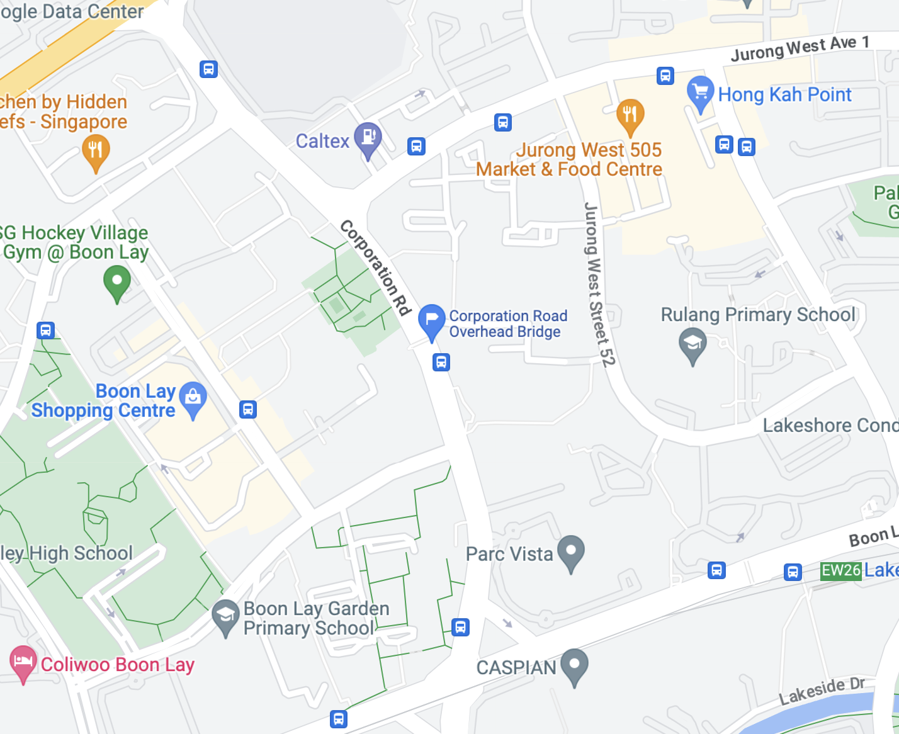
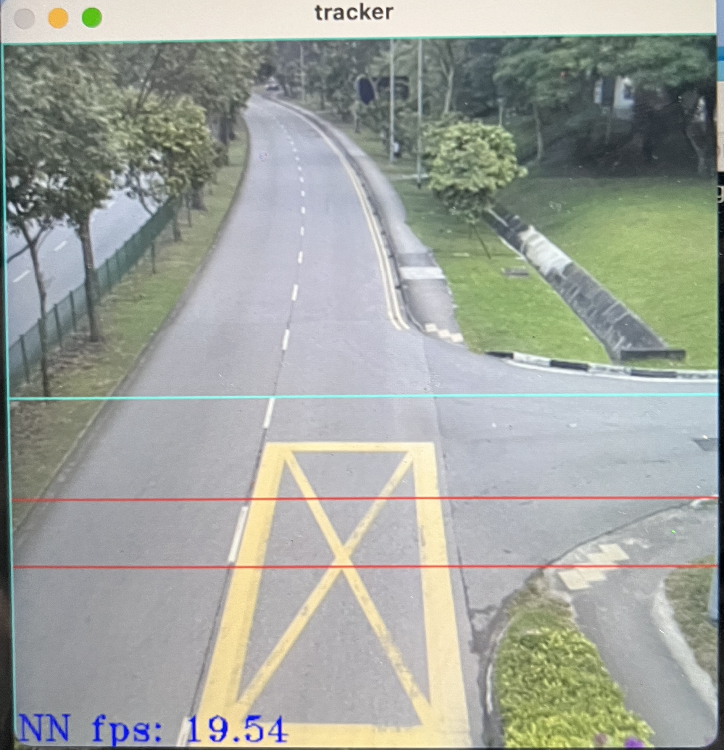
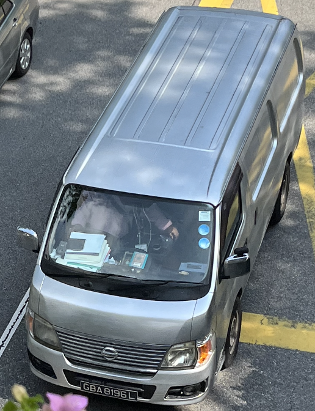
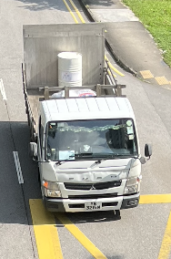
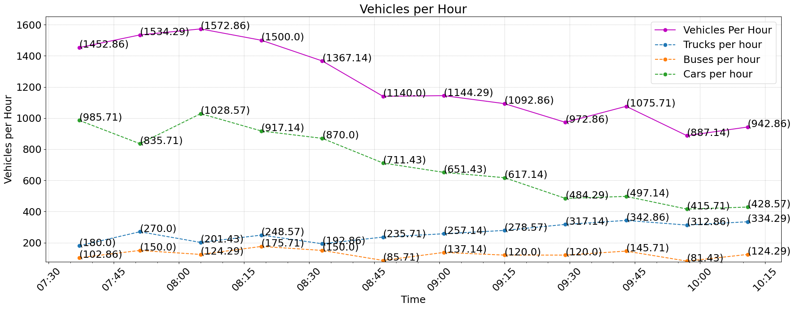
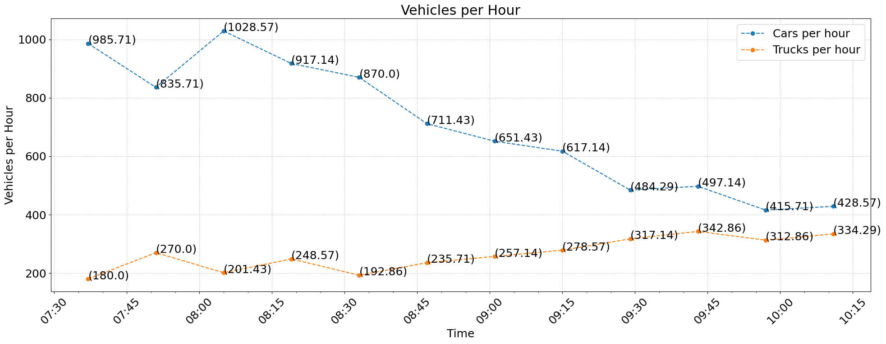
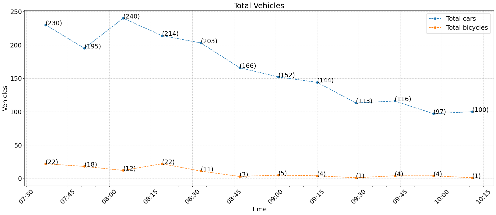
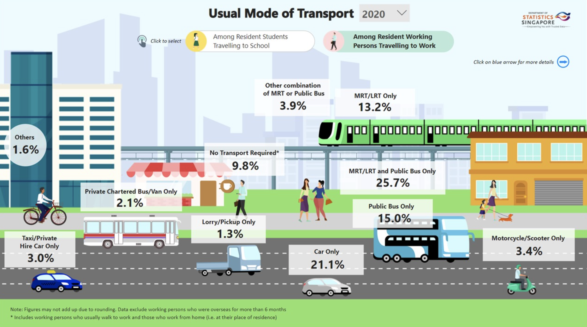

# Overhead Bridge on Corporation Road

## Context
Surveyed from overhead bridge on Corporation Rd. - a large and busy street which not only has plenty of commuting traffic, but also various large and oddly-shaped trucks. Served as a challenge for the YOLO detection network.

### Time: 
07:30:00 - 10:23:00 (02:53:00)

### Location: 
(1.3472376, 103.7156202)

 

## Data Collection

### Camera Point-of-View

### Raw Data
See [Raw Data from Corporation](../data/raw_data/Corporation%20Compiled,3489,02:53:09,07:30:00.txt)

## Data Analysis

### Observations

  - When facing towards the traffic rather in the same direction as it, the detection network was much more accurate at recognizing motorbikes and mopads. This could be due to a more uniform front - many motorbikes had a food delivery box on the back of them.
  - As shown in [Figure 1](#figure-1-unconventionally-shaped-vehicles-silver-mini-bus-and-truck-with-large-backing), many vehicles that passed through Corporation Road were not all typical cars, trucks, and buses. The silver mini-bus was labeled as "bus", while the truck with large backing was labeled "truck"

#### Figure 1: Unconventionally shaped vehicles:  silver mini-bus and truck with large backing

 

### Graphs

#### Figure 2: All Vehicles, with Isolation of Cars, Trucks, and Buses (Vehicles Per Hour)

#### Figure 3: Isolation of Cars and Trucks (Vehicles per Hour)

#### Figure 4: Isolation of Cars and Bicycles (Total Vehicles)

### Analysis

There are some interesting observations about traffic in this area that arose after inspecting the graphs:

**Peak Hours & Road Capacity:**
 - Morning peak/rush hours in Singapore are from roughly **7:30 A.M. to 9:30 A.M.** From this data sample, this trend is observed, with the **peak vehicles per hour (1572) occuring between 8:00 A.M and 8:15 A.M.** The least vehicles per hour was recorded between 9:45 and 10:00 A.M, after most commuting had subsided.
    - According to Main Roads Western Australia, a 60km/h speed limit on a carriageway such as Corporation Road's would have a favorable capacity of **2,454 vehicles per hour**.

**Nature of Corporation Road:**
 - An interesting trend is noticed when isolating the rate of cars per hour and trucks per hour [(see Figure 3)](#figure-3-isolation-of-cars-and-trucks-vehicles-per-hour). On Corporation Road, only **57.2%** of vehicles observed were cars. **21.9%** of all vehicles observed were trucks. Additionally, when looking at [Figure 3](#figure-3-isolation-of-cars-and-trucks-vehicles-per-hour), the amount of trucks increases over time, opposite of the cars, which drop. At a certain point, the amount of trucks and cars on the road become very close. This trend was not observed in various other locations such as Lakeside Station and Westgate Mall.
    - This could be due to the nature of Corporation Road. It is located in Jurong East, which is on the west side of Singapore. It is bisected into 2 areas: residential and industrial. In the industrial area, there are many construction zones along with manufacturing areas. For example Hyundai's IONIQ 5 car is manufactured in this area.
    - Therefore, Corporation Road has a large proportion of trucks and other industrial vehicles in relation to cars. This trend can be observed due to the YOLO detection network's **ability to differentiate vehicles types.**

**Commuting Vehicle Makeup**
 - [Figure 5](#figure-5-infographic-of-usual-mode-of-transport-for-commuters-going-to-work) is an infographic depicting the makeup of modes of transportation used when commuting to work. The infographic shows that there **21.1%** of Singapore civilians **only** use cars, while **1.6%** of civilians use other modes of transportation, namely bicycles.
    - Bicycling and using other forms of transportation for commuting is a large part of Singapore's infrastructure as a city. Due to promotion of environmentally-conscious modes of transport and the presence of NParks Park Connector Networks (PCR), bicycling is quite popular in relation to other cities.
 - Isolating data for cars and bicycles, [(see Figure 4)](#figure-4-isolation-of-cars-and-bicycles-total-vehicles), the ratio of bicycles to cars can be observed. The trend of peak/rush hours between both vehicles is upheld, and we can additionally find the ratio of bicycles to cars using the [Data Interpreter script](../data_analysis/DataInterpreter.py), which compiles the raw data into a spreadsheet containing useful information.
    - In my data, the ratio of bicycles to cars is **1:18**. From the infographic, the ratio is **1:13**. The general ratio of these vehicles can be observed by this sample, but there are some reasons as to explain the difference.
    - By looking at the [camera's POV](#camera-point-of-view), there are 2 car lanes in contrast to one sidewalk. Additionally, the sidewalk is narrow and not designed for bicycle traffic, showing that Corporation Road is not commonly used by bikers.
 - Similar ratios corresponding to the infographic can also be observed with other vehicles, providing valuable data towards Singapore's commuting vehicle makeup.
#### Figure 5: Infographic of Usual Mode of Transport for Commuters Going to Work
