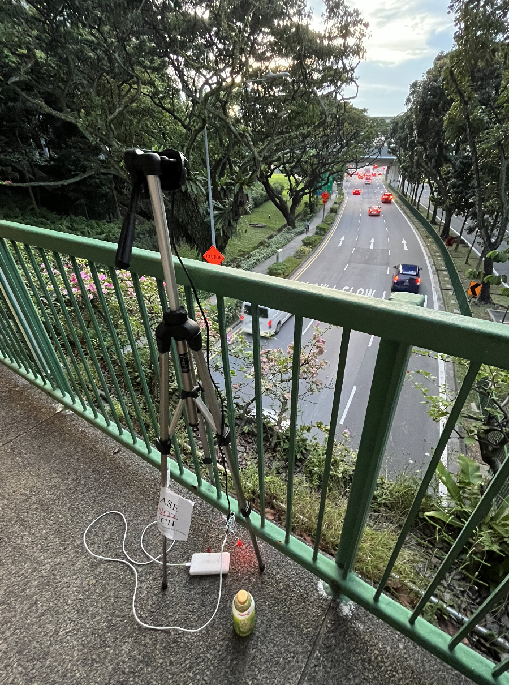

# Overhead Bridge Near Westgate Tower Mall

## Context:
Surveyed from overhead bridge in between Westgate Mall and busy 4-way Intersection [(see maps)](#location-133656-10374209). Area of interest due to the nature of the road: high traffic between a mall and an intersection, especially during commuting hours.

This dataset was recorded over a span of 3 consecutive days. Data was later combined using the "combine" method within the [Data Interpreter script](../data_analysis/DataInterpreter.py)

### Time: 
16:25:50 - 20:31:48 (4:05:58)

### Location: 
(1.33656, 103.74209)

 

## Data Collection

### Camera Point-of-View

### Raw Data
See [Raw Data @ Westgate](<../data/raw_data/Data Sample 8,4525,00:51:00,16:25:00.txt>) for full raw data

## Data Analysis

### Observations

 - When facing in the same direction as vehicles, therefore looking at the back, the detection network struggled with **motorbikes**. This could be due to the lack of uniformity compared to the front, as well as better detection network training when looking at a front-facing bike.
    - The network did not struggle with cars, trucks or buses however.
    - At times, the camera **must** face the same direction as the traffic, because billboards cover the other view.
 - The detection network did not falter or struggle in rainy conditions.
 - **IMPORTANT:** it should be noted that this sample is more of a test of the combining data method. It should **not** be treated as a definitive and extremely reliable sample.

### Graphs

#### Figure 1: All Vehicles, with Isolation of Cars, Trucks, and Buses (Vehicles Per Hour)

#### Figure 2: Isolation of Cars, Trucks, and Buses

### Analysis

The following observations were made following data collection

**Peak Hours and Road Capacity:**
 - Evening peak/rush hours in Singapore are from roughly **5:30 P.M. to 7:30 P.M.** From this data sample, this trend can be observed, with the **peak vehicles per hour (2010)** occuring between **6:30 P.M. and 6:45 P.M.** The least vehicles per hour was recorded between **7:45 P.M. and 8:45 P.M.**, after most commuting had subsided
    - Traffic was smooth throughout, however during the peak hours a substantial build-up in vehicles would occur during red lights.

**Nature of Surveyed Road:**
 - Compared with other roads such as Corporation Road (see [Corporation Road Writeup](corporation.md#analysis)), this section of Boon Lay Way contains a much higher percentage of cars(**71.1%**) as shown in [Figure 1](#figure-1-all-vehicles-with-isolation-of-cars-trucks-and-buses-vehicles-per-hour). Additionally, as seen in [Figure 2](#figure-2-isolation-of-cars-trucks-and-buses), buses and trucks are significantly less affected by rush hour, suggesting that this section of Boon Lay Way is mainly used by commuters. As most of the traffic is coming from Westgate Mall, this could be true.
   - These conclusions can be arrived upon due to the detection network's **ability to differentiate vehicles**

**Combining Data:**
 - As noted in [observations](#observations), the data that was collected was in 3 chunks, recorded throughout 3 days. The following chunks were: **4:25 to 6:19, 6:19 to 6:49, and 6:49 to 8:30.** What is important is that the spike in traffic from 6:19 to 6:49 is due to the fact that in this instance, the network was also counting pedestrians, while the other samples were simply counting vehicles. Therefore, although this combining and splicing of data is useful for observing general trends, one must be sure that the parameters for each smaple are **exactly** the same.
   - Even then, this data should be used cautiously, and mainly serves to demostrate how it is possible to add together datasets.

## Gallery

    