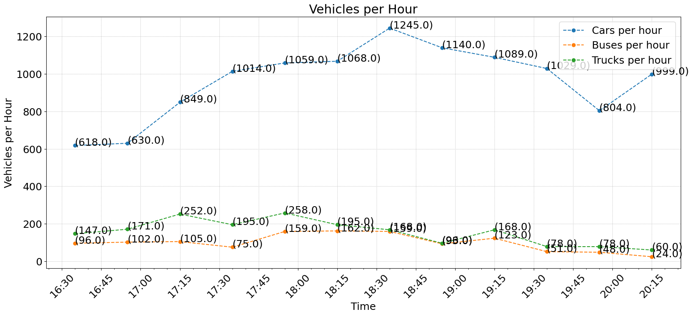

# Overhead Bridge Near Westgate Tower Mall

## Context:
Surveyed from overhead bridge in between Westgate Mall and busy 4-way Intersection [(see maps)](#location-133656-10374209). Area of interest due to the nature of the road: high traffic between a mall and an intersection, especially during commuting hours.

### Time: 
16:25:50 - 20:31:48 (4:05:58)

### Location: 
(1.33656, 103.74209)

 

## Data Collection

### Camera Point-of-View

### Raw Data
See [Raw Data @ Westgate](<../data/raw_data/Data Sample 8,4525,00:51:00,16:25:00.txt>) for full raw data

### Graph

## Gallery

    